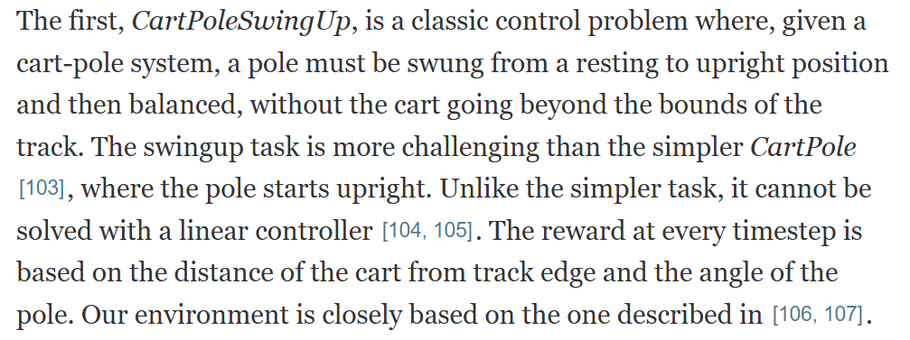
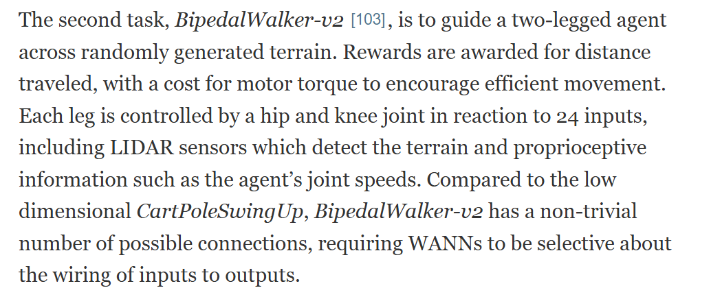

# 1. Methodology
## Tasks and mathematical modelling
WANNs with undifferentiable activations will be tested on MNIST digit classification and 2 continous control tasks:
+ CartPoleSwingUp:

+ BipedalWalker-v2: 

+ image classification: The MNIST database consists of 24x24 images of handwritten digits. It has a training set of 60,000 examples, and a test set of 10,000 examples. The model receives all images from the test set and must predict the class for each one. The metric used for evaluating its prediction is accuracy (number of correct predictions / total number of predictions).

## Comparison
I will compare my results with those of the original WANN paper. I will compare model size, convergence rate and how well the tasks are performed.
## Mathematical modelling

Image classification works like this: 

# 2. Case study
I used the repository of the original WANN paper and expanded it.

Experiments were made on the classification task.

Experiment 1:
+ run the the evolutionary algorithm (all hyperparameters exactly as in the original paper) for 120 generations on the MNIST training
+ evaluate the resulting WANN on the test set with a sweep of 10 global weights in the range [-2, 2]
+ results:
    + mean accuracy across all global weights: 0.55 
    + highest accuracy: 0.6299 (with weights set to 1.(9))
    + model size: 187

Experiment 2:
+ run the the evolutionary algorithm (all hyperparameters exactly as in the original paper) for 120 generations on the MNIST training but add 5 nondifferentiable functions to the activations set: 
    + x/|x| 
    + 1/x
    + sin(x)/x
    + 1/(x^2)
    + sin(1/x)
+ for all of the above x becomes 0.0001 if it is equal to 0 to avoid division by 0
+ evaluate the resulting WANN on the test set with a sweep of 10 global weights in the range [-2, 2]
+ results:
    + mean accuracy across all global weights: 0.43
    + highest accuracy: 0.5209 (with weights set to -2)
    + model size: 202

## Interpreting the results
The resulting WANN of the evolutionary search is worse at performing the classification task when adding undifferentiable functions to the search space, but this is expected. The search space of the activations is 55% larger and convergence didn't occur in any of the experiments because the evolutionary algorithm wasn't allowed to run for enough generations. The extended WANN would need to run for more generations than the original one to achieve convergence. Additionally, more numerous generations would benefit the extended WANN because it would allow it to sample a higher percentage of the activations. Because of the larger size of the extended model, we can deduce that not enough individuals sampled satisfactory activations, thus leading in more connections and increased model size. 

Another important factor to take into account is the quality of the newly added activations. Many of them might not be good candidates simply because they tend to infinity when x approaches 0, thus completely breaking the information flow of the networks because of the lack of normalization.

# 3. Related work
Researchers have tried many different methods of training neural networks which stand apart from the traditional gradient-based one. Pruning randomly initialized NNs to find "lottery tickets" (smaller models wich can already perform the task without needing to train their weights) has shown impressive results [[1]](#1) [[2]](#2) [[3]](#3) [[4]](#4). Others have tried using discontinous activations in networks to improve performance [[5]](#5) [[6]](#6) [[7]](#7). My aproach is a combination of the latter and the one used by Weight Agnostic Neural Networks [[8]](#8).It is worth noting that some researchers have experimented with learning both weights and connections [[9]](#9).

## Weigth Agnostic Neural Networks
WANNs are created through architecture search that uses evolutionary algorithms. All weights are set to the same value and the network learns its architecture (nodes, connections, activations). The evolutionary algorithm tests them on a set of weights from a predefined range to make sure that they work well regardless of the weights used.

## Improving WANNs
Since WANNs don't need to be trained with gradient-based methods to perform well, they aren't limited by the need for differentiability, thus we can model neuron activations using a vaster array of functions. For example, WANNs could use step functions as excitation operations for the outputs of the nodes that connect to it. 

## Expected results
Extended WANNs could perform tasks better than their counterparts, but also be smaller in size. Why? As described in [[10]](#10), NNs approximate functions, but if the function that a WANN tries to approximate is already in the search space of the activations, then it can simply use it instead of adding numerous nodes and connections to approximate it. 

Regarding task performance, even though convergence will be slower, extended WANNs might show better results due to the nature of the tasks. For example, if the function which perfectly solves a tasks is not differentiable, then a classical NN can only approximate it, while extended WANNs have the potential of becoming that function.

# 4. Repository history
I don't have the history because I started coding before carefully reading the assignment. I worked on the repository many hours in 2 days: the first day for making it run and the second for extending (and understanding) the repo and for running the 2 small experiments.

# 5. References

[1] Zhou, Hattie, Janice Lan, Rosanne Liu, and Jason Yosinski. "Deconstructing lottery tickets: Zeros, signs, and the supermask." Advances in neural information processing systems 32 (2019).

[2] Ramanujan, Vivek, Mitchell Wortsman, Aniruddha Kembhavi, Ali Farhadi, and Mohammad Rastegari. "What's hidden in a randomly weighted neural network?." In Proceedings of the IEEE/CVF conference on computer vision and pattern recognition, pp. 11893-11902. 2020.

[3] Malach, Eran, Gilad Yehudai, Shai Shalev-Schwartz, and Ohad Shamir. "Proving the lottery ticket hypothesis: Pruning is all you need." In International Conference on Machine Learning, pp. 6682-6691. PMLR, 2020.

[4] Orseau, Laurent, Marcus Hutter, and Omar Rivasplata. "Logarithmic pruning is all you need." Advances in Neural Information Processing Systems 33 (2020): 2925-2934.

[5] Forti, Mauro, M. Grazzini, Paolo Nistri, and Luca Pancioni. "Generalized Lyapunov approach for convergence of neural networks with discontinuous or non-Lipschitz activations." Physica D: Nonlinear Phenomena 214, no. 1 (2006): 88-99.

[6] Ding, Xiaoshuai, Jinde Cao, Ahmed Alsaedi, Fuad E. Alsaadi, and Tasawar Hayat. "Robust fixed-time synchronization for uncertain complex-valued neural networks with discontinuous activation functions." Neural Networks 90 (2017): 42-55.

[7] Forti, Mauro, and Paolo Nistri. "Global convergence of neural networks with discontinuous neuron activations." IEEE Transactions on Circuits and Systems I: Fundamental Theory and Applications 50, no. 11 (2003): 1421-1435.

[8] Gaier, Adam, and David Ha. "Weight agnostic neural networks." Advances in neural information processing systems 32 (2019).

[9] Han, Song, Jeff Pool, John Tran, and William Dally. "Learning both weights and connections for efficient neural network." Advances in neural information processing systems 28 (2015).

[10] Hanin, Boris. "Universal function approximation by deep neural nets with bounded width and relu activations." Mathematics 7, no. 10 (2019): 992.